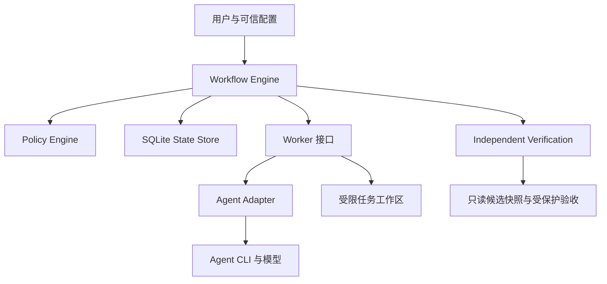

# 架构

Supervisor 是控制面；Worker 是执行面，不假定与 Supervisor 同机。初版只实现 LocalWorker，SSH/RemoteWorker 保留协议，不提前实现运输层。

## 模块职责

| 模块 | 负责 | 禁止承担 |
| --- | --- | --- |
| `core/` | 状态转换、角色路由、预算与证据检查 | 拼接厂商 CLI、猜测业务规则 |
| `agents/` | CLI 参数、输出解析、实际能力证明 | 改写策略、直接决定验收 |
| `workers/` | 进程、取消、超时、执行环境与输出上限 | 把本地绝对路径当成远程路径 |
| `workspace/` | 基线、工作区、快照和差异 | 清除用户文件、自动 reset/push |
| `policy/` | 冻结可信规则、检查能力与范围 | 从 Agent 输出接受新权限 |
| `verification/` | 在隔离环境运行可信检查并汇总 | 仅相信实现者的测试日志 |
| `storage/` | 状态、操作意图、事件、证据索引 | 仅凭状态值重放任意副作用 |

## 数据流

可信配置 → 能力验证 → 干净基线 → 冻结 TaskBundle → 运行角色 → 收集候选快照 → 独立验证 → fresh Review → 有条件转换。

任务内容和证据均存储在控制面管理的路径。Agent 只获得必要的输入、任务工作区和被允许的凭证路由。运行产物默认写在忽略目录 `.supervisor/runs/<run_id>/`；远程 Worker 使用自身路径映射，控制面只保存 worker ID 和相对 artifact 标识。

## 持久化边界

- 数据库：runs、attempts、operations、events、reviews、verifications、artifacts。
- 操作记录有 operation ID、attempt ID、状态、意图、证据摘要。
- 单次状态转换与转换事件在同一 SQLite 事务中提交；事件投递可以重复，以 event ID 去重。
- 在进程启动前先写意图；完成时持久化输出和摘要，再推进状态。
- 崩溃窗口内不能保证任意外部命令恰好执行一次。无法确认时进入 `NEEDS_HUMAN`，不得自动重跑。
- Worker 完成消息可能重复或过期；仅接受当前 attempt 和匹配摘要的结果。

SQLite 与证据目录均对 Worker 不可写。配置、锁文件和 schema 的更新作为独立规格变更处理。
